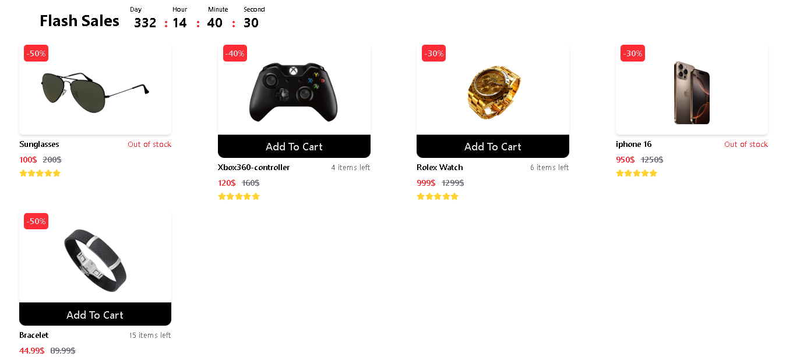
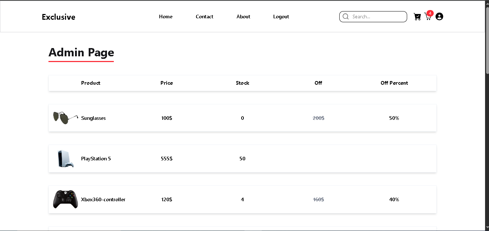
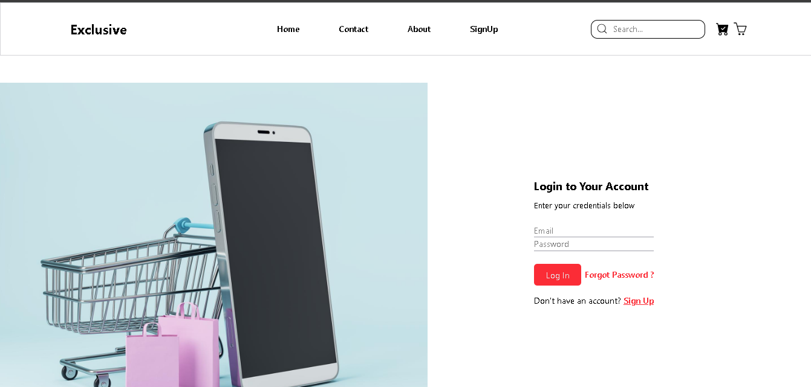

# 🛍️ Ecommerce Fullstack App

A full-featured e-commerce application built with **React**, **Node.js**, **Express**, **MongoDB**, **Stripe**, **Zustand**, and **React Query**.

Users can browse products, add to cart, check out securely via Stripe, and manage orders. Admins can create, update, and delete products with image uploads.

---

## 🔧 Tech Stack

### Frontend
- React
- React Router
- Zustand (State Management)
- React Query (API Caching)
- TailwindCSS (UI Styling)
- Stripe Checkout
- Axios

### Backend
- Node.js
- Express.js
- MongoDB (via Mongoose)
- JWT Authentication
- Stripe API

---

## 📸 Screenshots

### 🏠 Home Page  
  

### 🛠️ Admin Page  

### 🔐 Login Page  

---

## 🚀 Features

- 🔍 Browse and filter products
- 🛒 Add to cart and checkout
- 👤 JWT-based authentication
- 💳 Stripe payment integration
- 🧑‍💼 Admin panel for managing products
- 🧾 Order and stock tracking
- ⚡ Optimistic UI updates with React Query

---

---

## 🚀 Getting Started

### 1️⃣ Clone the Repository

git clone https://github.com/Behrad-BeigZadeh/ecommerce-fullstack.git
cd ecommerce-fullstack

🔙 Backend Setup

in root
npm install

Create a .env file in the backend directory:
PORT=5000
MONGO_URI=your_mongo_connection_string
JWT_SECRET=your_jwt_secret
STRIPE_SECRET=your_stripe_secret_key
CLOUDINARY_CLOUD_NAME=your_cloudinary_name
CLOUDINARY_API_KEY=your_cloudinary_key
CLOUDINARY_API_SECRET=your_cloudinary_secret

npm run dev

---

🖥️ Frontend Setup

cd client
npm install

Create a .env file in the frontend directory:
VITE_API_BASE_URL=http://localhost:5000/api
VITE_STRIPE_PUBLISHABLE_KEY=your_stripe_publishable_key
VITE_CLOUDINARY_UPLOAD_PRESET=your_upload_preset
VITE_CLOUDINARY_CLOUD_NAME=your_cloudinary_name

npm run dev

🧪 Stripe Test Card
To test Stripe payments, use the test card below:
Card Number: 4242 4242 4242 4242  
Exp Date: Any future date  
CVC: Any 3 digits  
ZIP: Any 5 digits  

